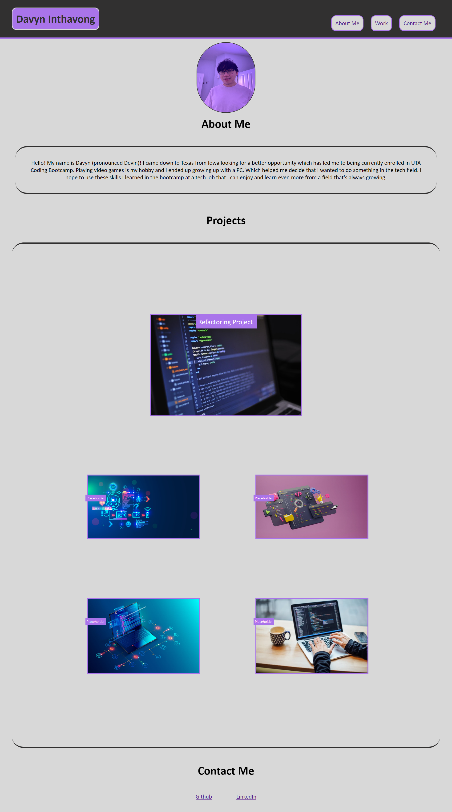

# My Portfolio

## Description

Creating this portfolio would help me showcase all the projects that I make and work on in the future to be easily accessed and viewed by 
anybody that would like to take a look and hopefully look into hiring me.
Making this portfolio also helped me see how HTML and CSS comes together along with how they build on top of each other. It just made things 
click in my head that I was struggling a little bit with.

## Installation

N/A

## Usage

To navigate my portfolio, use the navigation bar at the top right to bring you to differenct sections of my portfolio.

https://hajiru.github.io/professional-portfolio-hw/

## License

Please refer to the LICENSE in the repository.